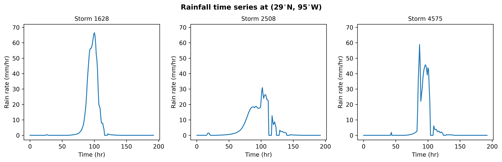

<p float="left">


</p>

# A tropical cyclone rainfall model for python


## Table of Contents

- [Overview](#books-overview)
- [Installation](#wrench-installation)
- [Getting Started](#arrow_forward-getting-started)
- [Gallery](#framed_picture-gallery)
- [License](#page_facing_up-license)
- [Acknowledgments](#people_hugging-acknowledgments)
- [Contacts](#mailbox-contacts)

## :books: Overview
**pyTCR** is a physics-based model developed in python to estimate rainfall induced by tropical cyclones (TCs). It is largely based on the TCR model described by [Zhu *et al.*, 2013](https://agupubs.onlinelibrary.wiley.com/doi/full/10.1002/2013GL058284) and [Lu *et al.*, 2018](https://journals.ametsoc.org/view/journals/atsc/75/7/jas-d-17-0264.1.xml). PyTCR simulates convective TC rainfall by correlating the precipitation rate with the total upward velocity within the TC vortex. It integrates seamlessly with outputs from [a tropical cyclone downscaling model](https://github.com/linjonathan/tropical_cyclone_risk) (see [Lin *et al.,* 2023](https://agupubs.onlinelibrary.wiley.com/doi/full/10.1029/2023MS003686)) to generate detailed spatial-temporal rainfall patterns that align with hurricane tracks.

## :wrench: Installation

1. Clone the pyTCR repository
    ```sh
    git clone https://github.com/levuvietphong/pyTCR.git
    ```

2. Navigate to the pyTCR directory and create a `conda` virtual environment using the provided `environment.yml` file
    ```sh
    conda env create -f environment.yml
    ```

3. Activate the environment:
    ```sh
    conda activate pyTCR
    ```

4. Install the PyTCR package:
    ```sh
    pip install -e .
    ```
> [!NOTE]
> If you pull latest changes from the repository, simply run `git pull` in the `pyTCR` directory. Reinstallation is not required.

## :arrow_forward: Getting Started
This repository provides a collection of [jupyter notebooks](https://github.com/levuvietphong/pyTCR/tree/main/notebooks) designed to facilitate the use of PyTCR for generating and visualizing rainfall and wind speedinduced by TCs. These notebooks cover various use cases and data sources, providing comprehensive guidance for users.

0. **Downloading Tropical Cyclone Data:** This notebook illustrates the process of downloading CMIP6 tropical cyclone tracks that have undergone downscaling using the [tropical cyclone downscaling model](https://github.com/linjonathan/tropical_cyclone_risk). [View it here](./notebooks/ex0_download_tracks_from_cmip6.ipynb).

1. **Visualizing Tropical Cyclone Tracks:** This notebook showcases the visualization of tropical cyclone tracks and their density, utilizing both observational data and downscaled CMIP6 outputs. [View it here](./notebooks/ex1_tropical_cyclone_tracks.ipynb).

2. **Rainfall Simulation:** This notebook use outputs from [the tropical cyclone downscaling model](https://github.com/linjonathan/tropical_cyclone_risk) to simulate rainfall driven by tropical cyclones. This includes rainfall at a specific location and over the entire domain of the tropical cyclone tracks. [Explore it here](./notebooks/ex2_rainfall_generation.ipynb).

3. **Wind Speed Generation:** This notebook demonstrates the generation of spatially and temporally varying wind speeds from downscaled CMIP6 outputs. [View it here](./notebooks/ex3_wind_speed_generation.ipynb).

4. **Rainfall within a Polygon:** This notebook outlines the process of generating total rainfall within polygons loaded from shapefiles. [Explore it here](./notebooks/ex4_rainfall_polygons_generation.ipynb).

5. **Multiple Rainfall Events within a Polygon:** This notebook generates multiple total rainfall events from multiple tropical cyclone tracks within a polygon. [View it here](./notebooks/ex5_multiple_rainfall_event_polygon.ipynb).

> [!IMPORTANT]
> Downscaled tropical cyclone tracks for various CMIP6 models (including `historical` and `ssp585` experiments) are available for download [here](https://web.corral.tacc.utexas.edu/setxuifl/tropical_cyclones/downscaled_cmip6_tracks).

## :framed_picture: Gallery
The following figures illustrate the inputs used in pyTCR and results obtained from PyTCR:

- **Tropical cyclone tracks:** The figure below shows the tracks of tropical cyclones downscaled from outputs from E3SM v1.0 model, Reanalysis ERA5, and best track observations.


- **Spatial Distribution of Total Rainfall:** The image below shows the spatial distribution of total rainfall along three storm tracks that made landfall in the Southeast Texas (SETx) region.


- **Time Series of Precipitation:** The figure below depicts the time series of precipitation at a specific location (29°N, 95°W) within the SETx region.




## :page_facing_up: License
Distributed under the MIT License. See [LICENSE](LICENSE) for more information.


## :people_hugging: Acknowledgments
This work was supported by the [Southeast Texas Urban Integrated Field Lab](https://setx-uifl.org/) () project, one of four [Urban Integrated Field Laboratories](https://ess.science.energy.gov/urban-ifls/) (UIFLs ). The software was mostly developed at the  (ORNL). We extend our gratitude to the SETx-UIFL team for their support and collaboration.


## :mailbox: Contacts
Collaborators and contributions are very welcome! For questions and feedback, please contact:
- Phong Le (lepv@ornl.gov)

<hr>

[Go to Top](#table-of-contents)