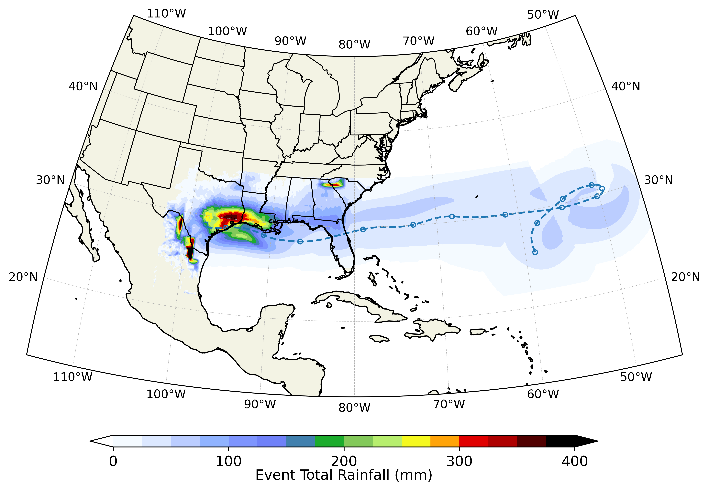

# Summary
`pyTCR` is a climatology software package developed in the Python programming language.
It implements a horizontally distributed and vertically integrated model [@Zhu:2013] for estimating rainfall driven by tropical cyclones (TCs). Along TC tracks, torrential rainfall is estimated by computing the cross-boundary-layer, upward water vapor transport caused by different mechanisms including frictional convergence, vortex strectching, large-scale baroclinic effect (i.e., wind shear), topographic forcing, and radiative cooling [@Lu:2018]. The package provides essential functionalities for modeling and interpreting spatio-temporal TC rainfall data. `pyTCR` requires a limited number of model input parameters, making it a convenient and useful tool for analyzing rainfall mechanisms driven by TCs.

To sample rare (most intense) rainfall events that are often of great societal interest, `pyTCR` leverages outputs from a statistical-dynamical TC downscaling model [@Lin:2023] capable of rapidly generating a large number of synthetic TCs given a certain climate. As a result, `pyTCR` significantly reduce computational effort and improves the efficiency in capturing extreme TC rainfall events at the tail of the distributions from limited datasets. Furthermore, the TC downscaling model is forced entirely by large-scale environmental conditions from reanalysis data or coupled General Circulation Models (GCMs), simplifying the projection of TC-induced rainfall and wind speed under future climate. Finally, `pyTCR` can be coupled with hydrological and wind models to assess risks associated with independent and compound events (e.g., storm surges and freshwater flooding).

# Statement of need
TCs -- that is, hurricanes and tropical storms -- are among the most destructive weather events, causing massive economic and human losses worldwide each year [@Krichene:2023]. In the United States, hurricanes even trigger a surge of deaths long after the storms through complex chains of lasting impacts [@Young:2024]. Much of the damage caused by TCs is done by water – particularly by torrential rainfall (which is sensitive to a variety of a storm's structural characteristics, intensity, and movement) and subsequent flooding [@Shi:2024;@Zhang:2018]. Accurately capturing TC rainfall characteristics at high spatial (~ 1 km) and temporal resolution (e.g, hourly) is therefore of critical importance. Moreover, a growing body of evidence suggests that TC rainfall is becoming more intense under a warming climate due to the Clapeyron–Clausius scaling of water vapor in the atmosphere, increasing the likelihood of extreme rainfall and flooding [@Emanuel:2021;@Zhu:2021]. Given the societal consequences of TCs, it is crucial to understand not only TC risk in the current climate, but also how the risk might evolve with warming. Advancing tools and models to accurately and efficiently quantify these risks is of great importance.

The ability of GCMs to simulate climate extremes has been significantly improved over the past few decades, primarily those participating in the Coupled Model Intercomparison Project phase 6 or CMIP6 [@Eyring:2016;@Kim:2020]. These climate models have become one of the main tools used for exploring the effect of global warming on precipitation and climate variability [@Emanuel:2021;@Le:2021;@Le:2023]. While high-resolution GCMs (i.e., HighResMIP) have improved the representation of TCs [@Haarsma:2016;@Li:2018;@Zhang:2024], they remain too computationally expensive for risk analysis, which requires robust sampling of extreme rainfall events. `pyTCR` responds to this need for an easy to use and efficient tool that faciliate TC rainfall analysis across scales. It takes the advantage of synthetic downscaling approach that can generate large ensembles of synthetic hurricanes at the basin (ocean) scale based on comprehensive climate conditions from observations and reanalysis data and GCM simulations [@Emanuel:2008;@Lin:2023].
`pyTCR` provides a fast and highly efficient tool for risk analysis related to TC rainfall.

# Mathematics
`PyTCR` implements a TC rainfall model described in @Zhu:2013 and @Lu:2018 that simulates along-track convective rainfall by relating the precipitation rate to the total upward velocity within the TC vortex. We refer to the study by @Lu:2018 for detailed formulation of this model. Here we give a brief overview of the main rainfall mechanisms used in the model and `pyTCR`.

Let $P$ be the precipitation rate [$LT^{-1}$] driven by TCs, it is calculated as:

$$P = \epsilon_p \frac{\rho_{air}}{\rho_{liquid}} q_s \max(w,0)$$ 

where $\epsilon_p$ is precipitation efficiency [-], $\rho_{air}$ and $\rho_{liquid}$ are the density of water vapor and liquid water [$ML^{-3}$], respectively (the ratio $\approx 0.0012$), $q_s$ is saturation specific \mbox{humidity [-]}, and $w$ is the upward vertical wind velocity [$LT^{-1}$] that brings surface moisture into the upper atmosphere.
The core function of `pyTCR` includes estimating $w$ as a linear combination of five major components:

\begin{equation}
w = w_f + w_h + w_t + w_s + w_r
\end{equation}

First, $w_f$ represents the velocity [$LT^{-1}$] induced by surface frictional convergence that depends on the boundary layer formulation. It is the dominant factor of $w$, estimated as:

\begin{equation}
w_f = \frac{-1}{r} \frac{\partial}{\partial r} \left(r^2 \frac{\tau_{\theta s}}{\partial M/\partial r}\right)
\end{equation}

in which $r$ is the radius from the storm center [$L$], $f$ is the Coriolis force [$T^{-1}$], $\tau_{\theta s}$ is the azimuthal turbulent stress [$L^{2}T^{-2}$], and $M=rV+\frac{1}{2} f r^{2}$ is the absolute angular momentum per unit mass [$L^2T^{-1}$]. Second, $w_h$ is the surface vertical velocity [$LT^{-1}$] represented as the topographically induced motion:

\begin{equation}
w_h = \mathbf{V} \cdot \nabla h
\end{equation}

where $h$ is the topographic height [$L$] and $\mathbf{V}$ is the horizontal wind velocity [$LT^{-1}$] given as the vector sum of the storm gradient wind (excluding the radial component) and environmental background wind. 
Third, $w_t$ denotes the vertical velocity component [$LT^{-1}$] arising from time dependence of the storm's vorticity (vortex stretching):

\begin{equation}
w_t = \int_b^H \frac{1}{r} \frac{\partial}{\partial r} \left(r \frac{\partial M / \partial t}{\partial M / \partial r} \right) dz \simeq H_b \frac{1}{r} \frac{\partial}{\partial r} \left(r \frac{\partial M / \partial t}{\partial M / \partial r} \right)
\end{equation}

in which $b$ is the height of the boundary layer [$L$], $H$ is the mid-level of the troposphere [$L$], and $H_b = H-b$ is a representative depth scale of the lower troposphere [$L$].
Fourth, $w_s$ denotes the baroclinic/shear component velocity [$LT^{-1}$] approximated as:

\begin{equation}
w_s \simeq \frac{g}{c_p(T_s-T_t)(1-\epsilon_p)} V \left(f+\frac{V}{r}+\frac{\partial V}{\partial r}\right)(\Delta \mathbf{V}_e \cdot \mathbf{j})
\end{equation}

where $c_p$ is the heat capacity of dry air [$L^{2}T^{-2}K^{-1}$], $g$ is the acceleration of gravity [$LT^{-2}$], $N$ is the buoyancy frequency for dry air [$T^{-1}$], $T_s$ is the surface temperature [$K$], $T_t$ is the tropospause temperature [$K$], $\mathbf{j}$ is the unit vector pointing radially outward from the storm center, and $\mathbf{V}_e$ is the vector wind shear across the troposphere. Finally, $w_r$ represents wind velocity [$LT^{-1}$] related to radiative cooling mechanism. For the sake of simplicity, it is set as a constant (-0.005 m/s) in `pyTCR` .

The TC downscaling model [@Lin:2023] provides `pyTCR` with 3-hourly information on TCs such as track, intensity, and size. Surface wind is estimated from the wind profile models [@Chavas:2015] based on TC intensity and size.
The storm-centered specific humidity $q_s$ is calculated from the 600 hPa atmospheric temperature and TC intensity at each time step following @Emanuel:2017.

# Examples

`pyTCR` provides an access point for TC rainfall tracks. Downscaled TCs are stored in the Texas Advanced Computing Center (TACC) Corral storage [@CorralTACCHPC]. `pyTCR` provides 6 example notebooks for users to get started with `pyTCR`. The notebooks include:
- Downloading and preprocessing TCs data
- Visualizing TC Tracks
- Generating TC extreme rainfall
- Generating Wind Speeds
- Generatig Rainfall polygons
- Generating Multiple rainfall event polygons

These six `jupyter` notebooks for tutorial and training are provided to help users unfamiliar with `pyTCR`. 
Moreover, TCs datasets obtained from the International Best Track Archive for Climate Stewardship (IBTrACS) and the TC downscaling model forced by CMIP6 models are also included in the repository for running `pyTCR`. 
Figure 1 shows the comparison of downscaled TCs between E3SM model and observations during historical period (1964-2014).
It highlights the ability of the TC downscaling model to reasonably reproduce the general behavior of TC observed over the past period, providing confidence for analyzing TC patterns in the future climate.

Along each TC track from the above model, `pyTCR` can generate time series of TC-induced rainfall. 
Figure 3 shows an example of the spatial distribution of total rainfall along a TC track. Time series of rainfall at any domain influenced by the TCs can be extracted in `pyTCR`.

# Acknowledgements
This work was supported by the U.S. Department of Energy, Office of Science, Biological and Environmental Research program and is a product of the Southeast Texas (SETx) Urban Integrated Field Laboratory (UIFL) project.

# References